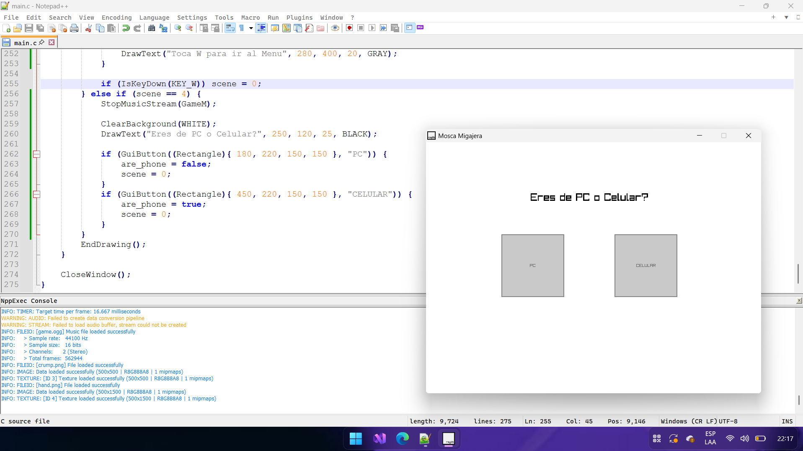

# Mosca-Migajera
Un juego que hize en medio dia.

Uhmm ayer estuve sin internet pq lo pague muy tarde asi que mientras volvia, vi que tenia raylib y notepad++ instalados y como vi uan mosca ensima de las sobras del pan de mi desayuno, y aparte estaba viendo videos de jasperdev con los pocos datos para youtube namas que me quedaban decidi hacer un juego de una mosca en 1 hora, el prototipo me tomo 10-20 minutos, despues dibujar texturas y hacer la musica , aparte de hacer la ui para telefono al dia siguente(hoy) me tomo 1 hora, aunque luego añadiir las clases le añadio 30 minutos... no lo hize con ia casi que detesto hacer las cosas con ia de hecho aca una prueba: 

como sea pueden ir a releases a descargar el .exe y .apk o ir a mi itch.io me da igual gracias. juegalo pls.
